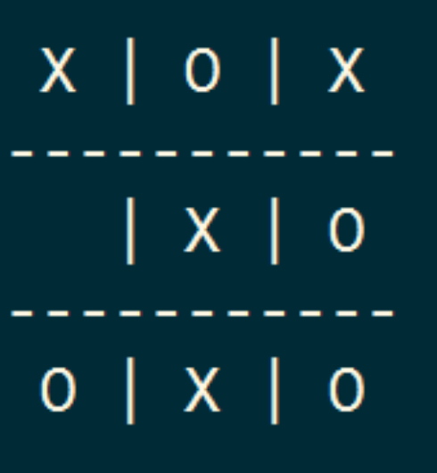

# Tic-Tac-Toe

Build a text-based version of the Tic Tac Toe game.

## Assignment

Using what you have learnt about Python programming, you will build a text-based version of the Tic Tac Toe game. The game should be playable in the command line just like the Blackjack game we created on Day 11. It should be a 2-player game, where one person is "X" and the other plays "O".

This is a simple demonstration of how the game works: [Tic-Tac-Toe on Google](https://www.google.com/search?q=tic+tac+toe)

You can choose how you want your game to look. The simplest is to create a game board using "|" and "\_" symbols. But the design is up to you.

If you have more time, you can challenge yourself to build an AI player to play the game with you.

## Summary

### What was hard?

I found it quite challenging to come up with an idea on how to approach the main game logic. At first, I created checked the actual game table and individual player's tables separately. However, when I implemented a computer player later on, I realized that it would be much more straightforward to indicate opponent fields as well on player level and calculate the winning situations there instead, thus the game table check became unnecessary and _table_ class handled only the table printing.

The hardest part was to implement a so called AI for single-player mode. First of all, I had to create a separate logic for single-player mode to mimic an automated player behavior. First I used random fields from the available fields, but there wasn't any challenge to defeat the computer then, so I decided to take this a little bit further. The computer logic uses the _player_ class as well, so I had to extend it to propose some fields that are available and can help to win the game. This logic only takes actual player's fields into account and does not care about the other player's possible win scenario. (It could be implemented later on to make AI even more smarter, however that's a goal for next time.)

The main game workflow is located in the _main_ and handles both single-player and multi-player modes. To make single-player mode a little bit more challenging, computer will have the advantage to start the game.

### What was easy?

Retrospectively, the single-player mode is quite straightforward once you can write the main logic for the game win calculation, because it is not required to handle different computer logic. It was quite easy to implement some checks for the name, score tracking, resetting the game and minor things like that.

### How might I improve for the next project?

In my opinion, dedicating more time to plan the logic could help me to improve to effectively tackle the challenging tasks. Step-by-step approach is almost mandatory in more complex projects as it is quite easy to lose the main goal and start every small task in parallel. This makes development harder and slower in the long term.

### What was my biggest learning from today?

I learned several things from this projects, such as how to print characters after each other with several _print_ statements by using _flush_. Other than that, I was able to come up with a basic computer logic that can strive to win. I learned how to use _set_ to remove the duplicates from a list. I learned how to use the _min_ function with a specific key that can help to return the shortest list. (_key=len_)

### What would I do differently if I was to tackle this project again?

I would definitely spend more time to look into the basic game logic. For now, it is designed for 3x3 table, however it is a pain to extend it due to some hard-coded values and the logic itself. It was written to calculate with only 3 fields rather than a customizable number and this could be improved. Other than that, the computer logic is a little bit messy in my opinion and I'm pretty sure there is a better way to implement a smarter AI, however I took too much time on it already and couldn't come up with a better solution (yet).

## Project status

The project is ready to use in both single-player and multi-player modes. There are some tasks to do later on:

- Implement computer logic to take user fields into account and strive to prevent user win.
- Implement some input checks to prevent exceptions (for example player number in _player_ class).
